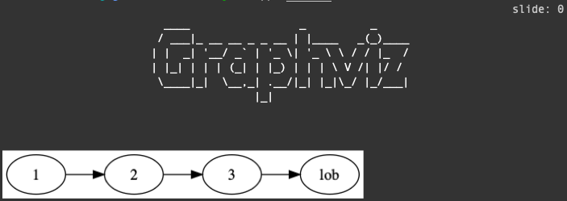

# Bio Project

My Own CLI

## Requirements

Python 3.7+

## Setup

```bash
pip install jw
jw --help
```

## Build

```
python setup.py install
```

## Feature

- imgcat
- tag memo system
- snippet
- markdown to presentation
- google calendar

## Create Your Own CLI

```python
# create bio/cli/yourfunc.py
from bio.cli.gfunc import GFunc
class YourFunc(GFunc):
    bioparser = GFunc.bioparser
    @bioparser.register
    @bioparser.add_argument('your_argument', type=str)
    def your_command(self):
        def func(your_argument, **kwargs):
            """main function"""
            pass
        return func
```

and just build it!

## Your Own Snippet

Put Bash Script in `scripts`

```bash
jw snip <your bash script> args...
```

## md2ppt Graphviz support

```
# test.md
` ```graphviz
  digraph "test" { rankdir=LR; 1 -> 2 -> 3 -> lob }
` ```
```

```
jw md2ppt test.md
```


